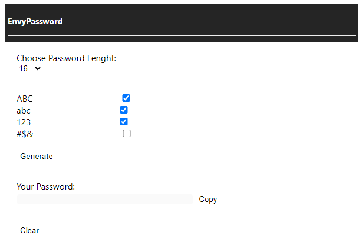

# Envy Password Generator


Hasilkan kata sandi secara acak dan mudah digunakan.

Ini adalah [Ekstensi](https://chrome.google.com/webstore/category/extensions?hl=id) untuk Google Chrome, dibuat dengan ```HTML``` dan ```Javascript``` yang sangat sederhana, ekstensi ini dapat digunakan di mana saja dengan mudah.


## Cara Penggunaan?

1. Unduh ekstensi dari tautan.
2. Buka [Ekstensi](chrome://extensions/) di Google Chrome.
3. Aktifkan ```Mode Pengembang```.
4. Klik ```Muat dibongkar```, dan cari direktori yang sudah kamu ekstrak.
5. Ekstensi siap digunakan.


## Bagaimana cara kerjanya?



Anda harus memilih panjang karakter kata sandi yang ingin Anda buat, dan pastikan Anda memilih jenis yang ingin Anda gunakan, dan setelah itu Anda hanya perlu menyalin hasilnya.


## Bahasa README
[English]()

[Indonesia]()
z