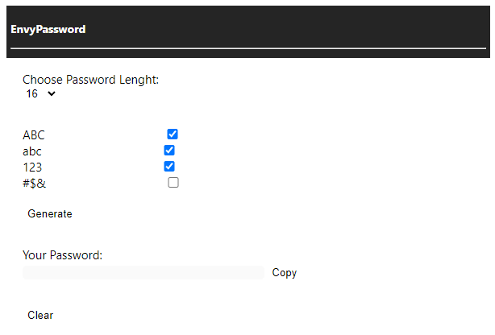

# Envy Password Generator


Generate password randomly and easy to use.

This is an for [Google Chrome Extension](https://chrome.google.com/webstore/category/extensions?hl=id), made with very simple ```HTML``` and ```Javascript```, this extension can be used anywhere easily.


## How to Use?

1. Download extension from the link.
2. Open the [Extensions](chrome://extensions/) in Google Chrome.
3. Active the ```Developer Mode```.
4. Click ```Load unpacked```, and search directory you have been extract.
5. The Extesion ready to use.


## How does it work?



You have to choose the character length of the password you want to generate, and make sure you choose the sort you want to use, and after that you just have to copy the results.


## Readme Language 
[English]()

[Indonesia]()
